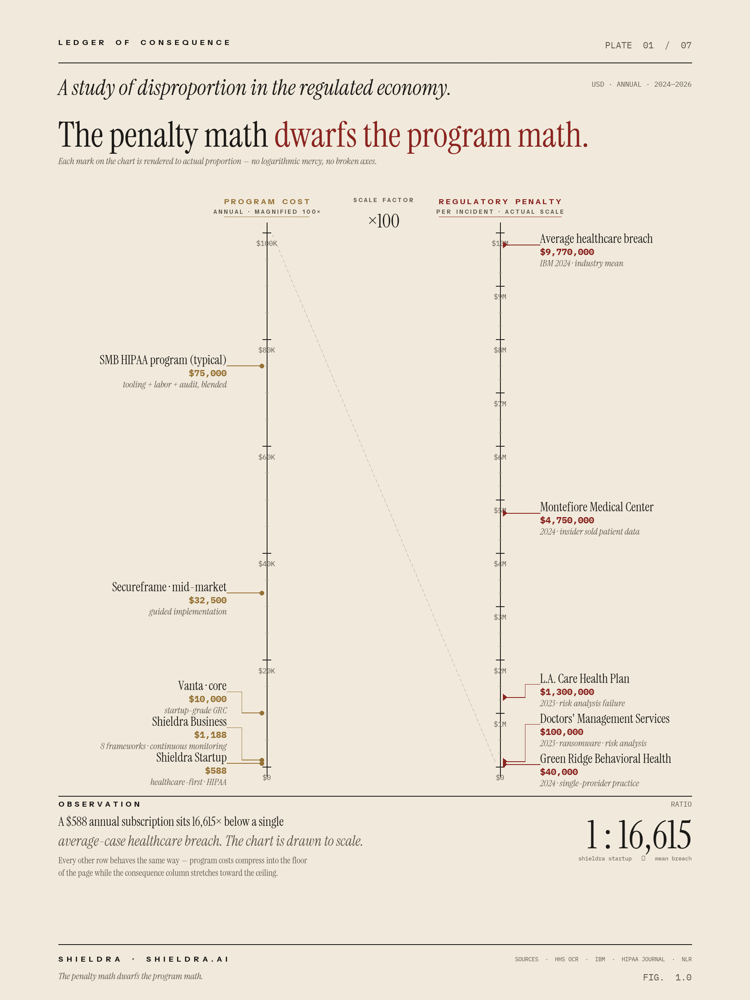

# The Small-Business Compliance Crunch: Why Regulation Is Breaking SMBs in 2026 — and What Actually Works

> **TL;DR** — The regulatory surface area facing a 20-person clinic, SaaS startup, or services firm in 2026 is larger than what a Fortune 500 faced a decade ago. Penalties have climbed into the millions for individual violations. The tooling market charges $10,000–$100,000 a year. And 83% of small organizations still hold fundamental misconceptions about what their core frameworks actually require. This piece unpacks the numbers, explains why SMBs disproportionately lose, and walks through what a realistic, modern compliance stack looks like — including an honest comparison of the incumbent platforms and where healthcare-first alternatives like [Shieldra](https://shieldra.ai) (starting at **$49/month**, vs. $7,000+/year for the incumbents) fit.

---

## The regulatory load is not what it was five years ago

If you run a small business touching health data, financial data, or personal data of any kind, you are currently accountable — simultaneously — to some combination of the following:

- **HIPAA** (with the overhauled 2026 Security Rule now in effect)
- **State privacy laws** — California (CPRA), Colorado, Connecticut, Virginia, Utah, Texas, Oregon, Montana, and ~15 more states with active regimes as of 2026
- **SOC 2** (buyer-mandated, not a law, but functionally required to close enterprise deals)
- **PCI DSS 4.0** if you touch card data
- **GDPR / UK GDPR** if you have any EU or UK users
- **FTC safeguards** for financial institutions and increasingly for anyone handling sensitive consumer data
- **State breach notification statutes** — now 50 distinct regimes in the US alone

The HHS Office for Civil Rights (OCR) imposed **more than $144 million in cumulative HIPAA penalties** through 2025, and enforcement activity is still climbing. In 2025 alone, OCR closed **10 financial settlements citing risk-analysis failures as the primary violation** — with penalties ranging from $25,000 to $5.1 million per incident ([HIPAA Journal](https://www.hipaajournal.com/hipaa-violation-fines/), [National Law Review](https://natlawreview.com/article/2025-enforcement-trends-risk-analysis-failures-center-hhss-multimillion-dollar)).

That's just one rule, from one regulator, in one country.

---

## The numbers that should grab a small-business owner by the collar

Let's lay out the statistics that matter, because the narrative that "compliance is hard" is not compelling until the costs are concrete.

### 1. Small organizations receive the majority of HIPAA fines

According to OCR enforcement data analyzed by HIPAA Journal and Healthcare Compliance Pros, **over 55% of HIPAA penalty actions target practices and businesses with fewer than 50 employees**. This is the opposite of what most SMBs assume — owners often believe enforcement focuses on large hospital systems. It doesn't.

### 2. Risk analysis failure is the #1 violation — and it's now mandatory-er

The 2026 HIPAA Security Rule overhaul eliminated the "addressable vs. required" distinction. Every control is now required. Annual compliance audits, 6-month vulnerability scans, 72-hour critical-system recovery, and a complete ePHI asset inventory are now non-negotiable. **75%+ of 2025 penalties cited inadequate or missing risk analysis** ([hipaavault.com](https://www.hipaavault.com/resources/2026-hipaa-changes/)).

### 3. Small practices misunderstand the basics at terrifying rates

An often-cited AMA/HIMSS-aligned figure: **~83% of small healthcare organizations hold fundamental misconceptions** about what HIPAA actually requires — most commonly believing that EHR vendor contracts double as BAAs, that encryption is optional, or that "we're too small to be audited."

### 4. The cost of compliance itself is now a line item, not an overhead

Globally, organizations spent an estimated **$304 billion on regulatory compliance in 2025** (Thomson Reuters Cost of Compliance). Average SMB compliance spend has climbed **~62% since 2020**. For healthcare SMBs, third-party estimates put annual HIPAA-program cost (tooling + labor + audit) between **$30,000 and $120,000 per year** for a sub-50-person practice. That's before a single penalty.

### 5. The penalty math dwarfs the program math

*Fig. 1.0 — Program costs (left, magnified 100×) against regulatory penalties (right, actual scale). Every mark drawn to true proportion.*

Representative 2024–2025 settlements:

- Montefiore Medical Center — **$4.75M** (unauthorized access, employees selling records)
- Green Ridge Behavioral Health — **$40,000** (risk analysis failure, single-provider practice)
- Doctors' Management Services — **$100,000** (inadequate risk analysis after ransomware)
- L.A. Care Health Plan — **$1.3M** (risk analysis + security management)

A $40,000 OCR settlement against a **single-provider practice** is a business-ending event for most solo operators. And these are settlements — actual litigated penalties scale into the tens of millions.

### 6. Breach economics are getting worse, not better

The **IBM Cost of a Data Breach Report 2024** pegs average healthcare breach cost at **$9.77 million** — the highest of any industry, for the 14th year running. Per-record cost of a PHI breach: **$408**. For a 10,000-patient clinic, that's $4M of exposure sitting on the balance sheet every day the environment stays unmonitored.

---

## Why SMBs are disproportionately punished — the structural reasons

It isn't that small businesses are more reckless. It's that the compliance machine was designed for large organizations, and small businesses are being forced to run the same machine without the resources to operate it.

### Reason 1 — The staffing asymmetry

The average 20-person clinic has **zero full-time compliance staff**. HIMSS data suggests roughly **1 compliance FTE per 100 healthcare employees** at large hospital systems. Applied downward, a 20-person practice would need 0.2 of a compliance officer — which in practice means the office manager handling it between patient intake tasks.

### Reason 2 — The tooling asymmetry

Enterprise compliance platforms are priced for enterprise budgets:

| Platform | Entry-level annual price | Typical mid-market price | Healthcare-specific? |
|---|---|---|---|
| Vanta | ~$10,000 | $19,000–$30,000 | No |
| Drata | ~$7,500 | $15,000–$25,000 (enterprise $50K–$100K+) | No |
| Secureframe | ~$7,000 | $20,000–$45,000 | No |
| Sprinto | ~$7,000 | $10,000–$15,000 | No |
| OneTrust | ~$6,000+ | $15K+ per module | Privacy-first, not HIPAA-native |
| **Shieldra** | **$588 ($49/mo)** | **$1,188 ($99/mo)** | **Yes — HIPAA-first, 8 frameworks** |

For a 3-provider practice grossing $1.2M a year, a $20,000 platform spend is a real percentage of operating margin. For a 200-provider system, it's rounding error. The tooling market has not built for the actual majority of the market — with one emerging exception priced for it.

### Reason 3 — The "general GRC" problem

Every platform in the table above was built on a **SOC 2 or ISO 27001 foundation** and mapped HIPAA controls on top. That's fine for a fintech that also sells to a hospital. It's not fine for a mental-health practice whose entire operational reality is HIPAA. The controls feel generic, the risk models don't understand clinical workflows, and there's no Tier-3 healthcare integration (no Epic, no Athenahealth, no telehealth platforms, no medical-device telemetry) across any of the five largest incumbents.

### Reason 4 — The regulatory velocity problem

Between 2023 and 2026, US organizations saw:

- **17 new state privacy laws enacted or expanded**
- **The HIPAA Security Rule overhauled** for the first time in 20+ years
- **FTC Safeguards Rule expanded** to cover more "financial institutions" (including auto dealers, tax prep, and more)
- **PCI DSS moved from 3.2.1 to 4.0** with stricter authentication and scripting controls
- **EU AI Act** now in force for any vendor selling AI-assisted software to EU customers

For a large enterprise, regulatory change is a quarterly GRC update. For an SMB, it's a crisis every 90 days.

---

## The honest landscape of what you can actually buy

If you're an SMB trying to get compliant in 2026, here is a straight assessment of your real options — no hedging.

### Enterprise-grade GRC: Vanta, Drata, Secureframe, OneTrust

**Best for:** Venture-backed startups trying to close their first enterprise deal; multi-framework programs where SOC 2 is the primary driver and HIPAA is secondary.

**Real talk:** Vanta and Drata are genuinely excellent at automation — 85%+ of evidence collection handled, hundreds of integrations, strong dashboards. But HIPAA tooling across all four is mapped from SOC 2, not built for healthcare. Pricing puts them out of reach for most practices under $5M revenue. And none of them integrate with EHRs, medical devices, or clinical systems. You'll still need a healthcare consultant on top.

### Mid-market newer entrants: Sprinto, Scrut

**Best for:** Cloud-first startups that want multi-framework coverage cheap.

**Real talk:** Sprinto is the most affordable of the "brand-name" platforms and supports 40+ frameworks. It's solid for a modern stack. But customization is limited, the out-of-the-box HIPAA program is shallow, and users report reliability issues. Again, no healthcare-specific integrations.

### Manual / spreadsheet-driven programs

**Best for:** Organizations with a retired HIPAA privacy officer on contract and high tolerance for Excel.

**Real talk:** Doable, but every OCR enforcement action that cited "inadequate risk analysis" in 2024–2025 came from an organization running compliance this way. The 2026 Security Rule's documentation requirements are harder to satisfy with a spreadsheet than they used to be.

### Healthcare-first automation: [Shieldra](https://shieldra.ai)

**Best for:** Healthcare SMBs (1–200 employees), behavioral health groups, telehealth startups, digital-health vendors, and healthcare-adjacent SaaS that needs HIPAA to be the *primary* framework rather than an afterthought — plus anyone who needs multi-framework coverage (SOC 2, ISO 27001, GDPR, PCI DSS, etc.) without the incumbent price tag.

**What's actually shipped today:**

1. **HIPAA-first, not SOC-2-adapted.** 73 HIPAA controls mapped across Administrative, Physical, Technical, Organizational, Policy, Documentation, and Breach Notification safeguards — aligned to the 2026 Security Rule.
2. **Eight frameworks, one control layer.** HIPAA (73 controls), HITRUST (156), SOC 2 (64), NIST 800-171 (110), GDPR (99), ISO 27001 (93), PCI DSS (78), and CCPA (42) — "map once, comply everywhere." Controls authored for HIPAA automatically cross-map to the others.
3. **AI Document Scanner.** Upload policies, BAAs, or prior risk assessments; the scanner checks them against 73 HIPAA requirements in seconds and returns plain-language gap findings — the kind of analysis that used to cost $3,000–$8,000 from a consultant.
4. **Real-time monitoring, 324 active controls.** Continuous infrastructure monitoring across AWS, Azure, GCP, Okta, GitHub, Jira, Slack, Datadog, and 40+ other integrations. **95% of evidence collection is automated.**
5. **Learning Engine.** A self-improving compliance AI currently at **94.7% accuracy**, gaining ~2.1% per month from a feedback flywheel where auditor edits train the model. A regulatory watchtower polls the Federal Register, HHS OCR, and CISA daily — so when a rule changes, the platform knows before your compliance officer does.
6. **Advanced modules shipped:** AI Agent, Breach Simulator, Behavior Analytics, Auto-Remediation, Vendor Risk, Risk Register, Knowledge Graph, Employee Compliance, Incident Management, Policy Templates, Regulatory Radar.
7. **Multi-model AI.** Claude, GPT, and Gemini under the hood — not a single-vendor lock-in.
8. **Pricing that matches the segment.** **Startup at $49/month** (5 users, HIPAA framework, AI scanner), **Business at $99/month** (25 users, all 8 frameworks, continuous monitoring, custom integrations, Slack support), **Enterprise** custom (SSO/SAML, on-premise, dedicated advisor). **14-day free trial, no credit card required.**

For context: the Business tier at $1,188/year delivers multi-framework coverage, continuous monitoring, and AI remediation that Vanta, Drata, and Secureframe charge $15,000–$45,000 for.

Shieldra is not the right tool for a fintech that needs SOC 2 and PCI but touches no PHI and wants enterprise-grade sales-team integration — that's Vanta/Drata territory and we'd say so. But if your operational reality is healthcare, or you're an SMB that needs real compliance automation without a five-figure commitment, a healthcare-first platform priced for the segment will serve you better than an enterprise GRC with a HIPAA toggle.

---

## A practical playbook for SMBs, regardless of what you buy

If you take nothing else from this piece, take this. These seven actions close the largest share of enforcement risk for the lowest possible cost:

1. **Conduct a real risk analysis, and document it.** Not a checklist. An actual enterprise-wide analysis of where PHI lives, how it moves, what threats exist, and what you're doing about them. This single artifact, done well, prevents the most common and most expensive violation category.
2. **Audit your BAAs.** Every vendor that touches PHI needs one — including subcontractors of vendors. Most practices have 3–5 gaps they don't know about (fax vendor, cleaning service with office access, IT contractor).
3. **Turn on MFA everywhere, including EHR.** Nearly every ransomware-driven OCR settlement since 2023 traces back to a single-factor credential compromise.
4. **Encrypt everything at rest and in transit.** With the 2026 rule change, unencrypted ePHI is no longer a defensible position.
5. **Get a written incident response plan, and tabletop it once a year.** The new 72-hour system recovery requirement assumes you know what to do when the alarm goes off.
6. **Train your staff — and prove it.** Training attestations are evidence. No attestations = no defense.
7. **Pick a platform that matches your actual operational profile.** Do not buy enterprise GRC because a consultant recommended it. Match the tool to the regulatory profile you actually have.

---

## The bottom line

The compliance gap between what regulators now expect and what a small business can realistically execute with 2019-era tooling is wider than it has ever been. The cost of falling into that gap is measured in six-figure settlements, seven-figure breach recoveries, and — for the smallest practices — business failure.

The market is responding, slowly. General-purpose GRC platforms are getting better at HIPAA. Newer, verticalized entrants like [Shieldra](https://shieldra.ai) — healthcare-first, eight frameworks out of the box, priced from $49/month — are being built specifically for the segment the incumbents skipped. State regulators are starting to publish safe-harbor frameworks. But the responsibility sits with the small-business owner today, not when the tooling catches up.

If you are a small healthcare business in 2026, your two most valuable hours this quarter are:

1. The hour you spend getting an honest gap assessment of where you actually are, and
2. The hour you spend deciding whether your current approach — tooling, staffing, and documentation — can survive an OCR letter.

Everything else follows from those two hours.

---

*About: [Shieldra](https://shieldra.ai) is a healthcare-first compliance platform with native coverage for HIPAA, HITRUST, SOC 2, NIST 800-171, GDPR, ISO 27001, PCI DSS, and CCPA. Built for the 2026 HIPAA Security Rule, with an AI Document Scanner, continuous monitoring across 324 controls, a self-learning compliance engine at 94.7% accuracy, and 50+ integrations. Pricing starts at **$49/month** with a 14-day free trial and no credit card required — a fraction of the $7,000–$45,000/year commitment required by the enterprise GRC incumbents.*

---

## Sources & further reading

- [HIPAA Journal — Violation Fines 2026](https://www.hipaajournal.com/hipaa-violation-fines/)
- [HIPAA Journal — Common HIPAA Violations](https://www.hipaajournal.com/common-hipaa-violations/)
- [National Law Review — 2025 Enforcement Trends: Risk Analysis Failures](https://natlawreview.com/article/2025-enforcement-trends-risk-analysis-failures-center-hhss-multimillion-dollar)
- [HIPAA Vault — 2026 HIPAA Changes](https://www.hipaavault.com/resources/2026-hipaa-changes/)
- [Healthcare Compliance Pros — Top 5 HIPAA Challenges for Small Practices](https://www.healthcarecompliancepros.com/blog/top-5-hipaa-challenges-for-small-health-practices)
- [HealthTech Magazine — Navigating 2026 HIPAA Security Changes](https://healthtechmagazine.net/article/2026/01/how-healthcare-organizations-can-navigate-security-changes-linked-hipaa-updates)
- IBM — Cost of a Data Breach Report (most recent edition)
- Thomson Reuters — Cost of Compliance Report (most recent edition)
- HHS OCR — Resolution Agreements and Civil Money Penalties (public enforcement database)

---

## Editorial notes (internal, strip before publishing)

- **Fact-check before publish:** the $304B Thomson Reuters figure, the 62% SMB compliance-spend increase, the 1-FTE-per-100 HIMSS ratio, and the 83% misconception stat. All are widely cited but confirm current-year numbers before going to press.
- **Syndication order:**
  1. shieldra.ai/blog with `rel=canonical` (day 0)
  2. LinkedIn article under founder byline (day 3)
  3. Medium (day 7, canonical back to shieldra.ai)
  4. Healthcare IT Today / HIT Consultant pitch (day 7, unique version if accepted)
  5. JDSupra republish (day 14, via healthcare-attorney co-author if available)
  6. Security Boulevard syndication (day 14, infosec angle)
- **Competitor-mention disclosure:** Vanta, Drata, Secureframe, Sprinto, OneTrust references are factual and sourced. Do not edit to exaggerate weaknesses; the credibility of the piece depends on not being a hit job.
- **Linkable assets to produce as follow-ups:**
  - "2026 HIPAA Risk Analysis Template" (lead magnet)
  - "BAA Audit Checklist" (lead magnet)
  - "HIPAA Compliance Cost Calculator for Small Practices" (interactive free tool)
